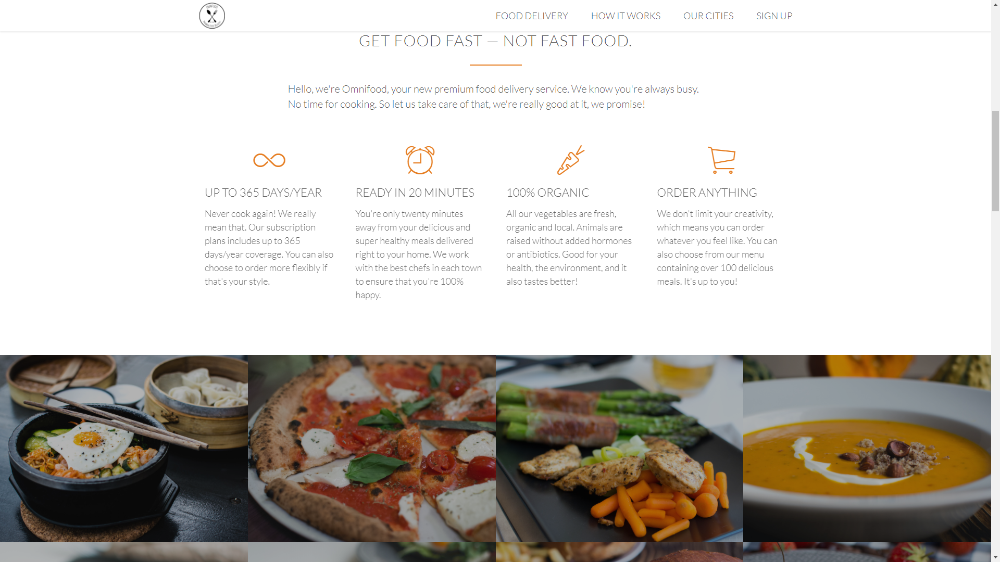

# omnifood-project

For a fictitious healthy food delivery company
Project for Udemy course by Jonas Schmedtmann

Responsive web site built with HTML5, CSS3 and some jQuery

[Link to Omnifood project website](https://foxystoat.github.io/omnifood-project/)

